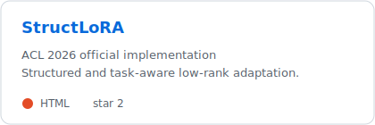
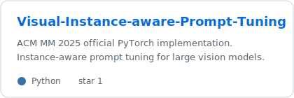
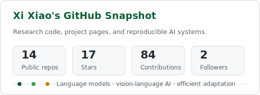
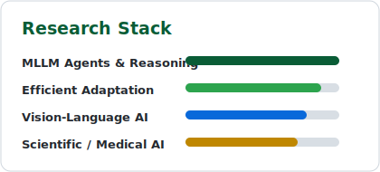

# Xi Xiao

**Efficient multimodal AI, agentic reasoning, and foundation models.**

[Research](#research) &nbsp;•&nbsp;
[Projects](#selected-projects) &nbsp;•&nbsp;
[GitHub](#github-snapshot) &nbsp;•&nbsp;
[Contact](#contact)

> [!NOTE]
> I am a Computer Science Ph.D. student at the University of Alabama at Birmingham, currently working as an Applied Scientist Intern at Amazon AGI. My research sits at the intersection of efficient adaptation, vision-language systems, MLLM agents, and scientific AI.

## Research

| Direction | Selected Work |
| --- | --- |
| Agentic AI and reasoning | [Agent Harness Engineering](https://picrew.github.io/LLM-Harness/), VIGIL, FORGE |
| Efficient model adaptation | [StructLoRA](https://github.com/xixiaouab/StructLoRA), Sensitivity-LoRA, CTR-LoRA |
| Vision-language systems | Prompt-based adaptation survey, RoadBench, Visual Instance-Aware Prompt Tuning |
| Scientific and medical AI | ORBIT-2, fMRI-LM, KG-SAM, medical image understanding |

## Selected Projects

## GitHub Snapshot

## Current Focus

- Building reliable MLLM and agent systems that reason over tools, context, and visual evidence.
- Designing efficient adaptation methods for large language and vision-language models.
- Translating foundation models into real-world scientific, medical, and infrastructure settings.

<b>Recent Research Signals</b>

| Venue | Work |
| --- | --- |
| ECCV 2026 | VIGIL, Prompt Fusion Discovery, and additional vision-language / forecasting work |
| ACL 2026 | StructLoRA |
| ICML 2026 | Dispersion loss for small language models |
| SC 2025 | ORBIT-2, Best Paper Award |

## Contact

- Website: [xixiaouab.github.io](https://xixiaouab.github.io/)
- Email: `xxiao [at] uab [dot] edu`
- Scholar: [Google Scholar](https://scholar.google.com/citations?user=Q4DnRVgAAAAJ&hl=en)

<a href="#readme-top">Back to top</a>

